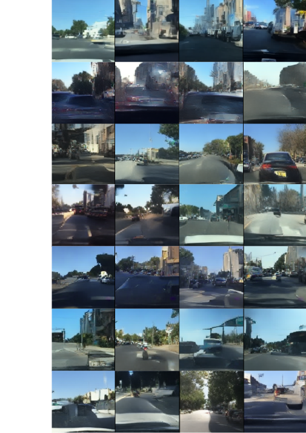

# Image Generation - MaskGIT

This repository hosts the code for image generation using MaskGIT framework. We use 1d-tokenizer outputs (learned latent tokens) which forms the input representation for the MaskGIT Image generation model.

<table>
  <tr>
    <td align="center"></td>
  </tr>
  <tr>
    <td align="center">Figure 1 : Image Generations using 64 learned latent tokens using different tokenizer models. MAE generates the best quality images with gFID of 82.57, better than Baseline</td>
  </tr>
</table>

## Contributions

We use 1d-tokenizer outputs (the learned latent tokens), which form the input representation for the MaskGIT Image generation model. We mask a subset of the input and check how token prediction improves over the training phase of the model. We additionally evaluate the models ability to generate an image completely from scratch, starting from all
the masked tokens and gradually filling them in. 

For performance evaluation, we compute the loss and accuracy over the masked tokens. Accuracy helps in visualizing if the
token prediction improves over the training phase of the model. 

## Checkpoints

gFID Scores for MaskGIT trained using different tokenizer inputs. Checkpoints for the same in 'checkpoints' directory.

| Tokenizer Model       |  gFID ↓   | 
|-----------------------|------------
| MAE                   |   82.57   | 
| CLIP                  |   87.01   |
| DINO                  |   85.42   | 
| DINO-v2               |   84.92   |
| Depth-Anything v2     |   94.73   | 
| Uninitialized Model   |   109.07  |
| Big Dataset - MAE     |           |

<table>
  <tr>
    <td align="center"></td>
  </tr>
  <tr>
    <td align="center">Figure 3 : Image Generation FID scores for different tokenizers. The plot shows the performance of varied models using 64 number of learned latent tokens from tokenizer</td>
  </tr>
</table>

## Requirements
A suitable python environment (For eg. `mamba`) named `tokenization` can be created and activated with:

```
mamba env create -f environment.yaml
conda activate tokenization
```

### Training MaskGIT
```
python main_pl.py --base configs/maskgit.yaml -t True --n_gpus=2 --logdir /work/dlclarge2/mutakeks-titok/maskgit

```
n_gpus: specifies number of gpus, default=1 \

### Fine-tune from previous checkpoint
```
srun python -m torch.distributed.launch --nproc_per_node=2 main_pl.py \
    --base /work/dlclarge2/mutakeks-titok/maskgit/config.yaml \
    -t True --n_gpus 2 --resumes /work/dlclarge2/mutakeks-titok/maskgit/checkpoints/last.ckpt 
```

### Compute FID score
```
python tools/fid.py --config_path /work/dlclarge2/mutakeks-titok/maskgit/config.yaml --ckpt_path /work/dlclarge2/mutakeks-titok/maskgit/checkpoints/last.ckpt --compute_rFID_score

```
### Compute FID score
```
python tools/compute_codebook_usage.py --config_path /work/dlclarge2/mutakeks-titok/mae_16/config.yaml --ckpt_path /work/dlclarge2/mutakeks-titok/mae_16/checkpoints/last.ckpt --compute_rFID_score
```

## Image Reconstruction

[1d-tokenizer](https://github.com/sejal-0502/1d-tokenizer.git)

